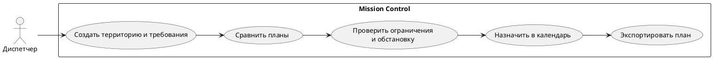
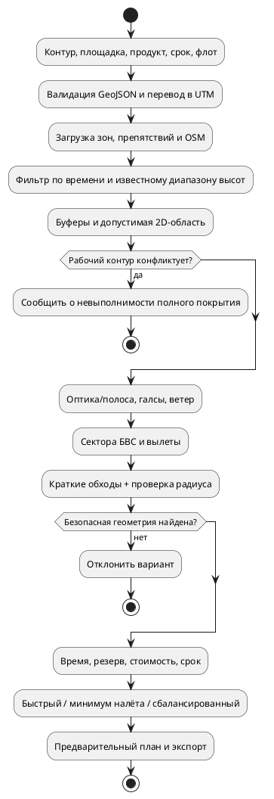

# Mission Control — техническое описание сервиса

Версия документа: 25.09.2026. Статус: описание работающего конкурсного прототипа; ограничения и планы отмечены отдельно. Это не руководство по получению разрешения на использование воздушного пространства и не готовый файл команд автопилота.

## 1. Проблема и цель

Подготовка групповой аэросъёмки разнесена между картой, расчётом оптики, каталогом БВС, проверкой воздушного пространства, погодой, графиком бортов и оценкой затрат. Ошибки возникают на стыках: подходящий по камере аппарат может не успеть по автономности; короткий маршрут может пересечь ограничение; несколько параллельных вылетов сокращают срок, но увеличивают суммарный налёт и стоимость.

Цель Mission Control — дать диспетчеру единое место для **предварительного** расчёта территории, техники, маршрутов, календаря и экономики, а также объяснить, почему вариант выполним или отклонён. Ключевая метрика зависит от задачи: минимальное время завершения при доступном флоте либо минимальный суммарный налёт при заданном сроке и числе БВС.

## 2. Сервис как бизнес-решение

Диспетчер задаёт контур работ, вид результата, исходную площадку, требования к качеству и ограничения. Сервис подбирает совместимые БВС и нагрузку, строит рабочие галсы и переходы, проверяет доступные данные об ограничениях и выдаёт варианты «быстрый», «минимум налёта» и «сбалансированный». Далее вариант можно сохранить в календарь и выгрузить в обменном формате. Стоимость разложена на компоненты, поэтому сравнение вариантов понятно руководителю и заказчику.

Это инструмент поддержки решения, а не автоматическое согласование полёта. Расчётные свойства БВС и нагрузки в каталоге частично учебные; перед фактическим вылетом необходимы проверенные паспорта оборудования, актуальные аэронавигационные данные, оценка местности и процедуры оператора.



## 3. Технологический стек и архитектура

| Слой | Реализация | Назначение |
| --- | --- | --- |
| Клиент | React 19, TypeScript, Vite, MapLibre GL 5, Lucide | Интерфейс, карты и редактирование геометрии |
| API | Python, FastAPI, Pydantic, Uvicorn | Контракты, сессии, проверки и интеграции |
| Геоалгоритмы | Shapely 2, pyproj 3.7 | Проекция WGS 84 ↔ локальная UTM, буферы, пересечения, маршруты |
| Хранилище | PostgreSQL 16 + PostGIS 3.4; отдельный SQLite | Основные данные в PostgreSQL; кеш полигонов населённых пунктов в SQLite |
| Внешние HTTP-клиенты | httpx | Погода, реквизиты, воздушное движение, Overpass |
| Радар | Pillow, NumPy | Преобразование анимированного изображения в прозрачные кадры карты |
| Развёртывание | Docker Compose, Nginx; опционально Caddy | Изолированные веб-, API- и DB-контуры |

База включает PostGIS для развития геопространственных запросов, но текущие пользовательские зоны хранят геометрию в `jsonb`, а планировщик выполняет значительную часть геоопераций в Shapely. Не следует описывать текущий поиск маршрута как SQL/PostGIS-алгоритм.

```plantuml
@startuml
skinparam componentStyle rectangle
[Браузер: React + MapLibre] --> [FastAPI] : HTTPS /api, WebSocket
[FastAPI] --> database "PostgreSQL + PostGIS" : миссии, зоны, календарь
[FastAPI] --> database "SQLite" : кеш населённых пунктов
[FastAPI] --> [Shapely + pyproj] : расчёт геометрии
[FastAPI] ..> [DaData / OpenSky / Open-Meteo] : необязательные HTTP
[FastAPI] ..> [Overpass / МЕТЕОРАД] : HTTP + кеш
[Браузер: React + MapLibre] ..> [OpenFreeMap] : стиль и тайлы
@enduml
```

## 4. Внешние интеграции

| Источник | Что получает сервис | Настройка и деградация |
| --- | --- | --- |
| [DaData](https://dadata.ru/suggestions/usage/party/) | Подсказки организаций и реквизиты по названию/ИНН | Зарегистрировать аккаунт, взять API-ключ в кабинете, записать `DADATA_API_KEY` в `.env`. Без ключа — ручной ввод. Кеш по запросу: 24 часа по умолчанию. |
| [OpenSky](https://openskynetwork.github.io/opensky-api/rest.html) | Позиции внешних воздушных судов ADS-B/MLAT | Зарегистрироваться, в странице аккаунта создать API client, скопировать `client_id` и `client_secret` в `OPENSKY_CLIENT_ID` / `OPENSKY_CLIENT_SECRET`. Сервер получает OAuth2-токен. Возможен анонимный режим с более редким обновлением; при настроенном `READSB_URL` локальный приёмник приоритетен. Внешний трафик не является телеметрией наших БВС. |
| [Overpass API](https://wiki.openstreetmap.org/wiki/Overpass_API) / OSM | Административные и `place`-полигоны населённых пунктов | `OVERPASS_URL`; для текущего публичного endpoint ключ не нужен. Отдельная SQLite-база хранит полигоны, версии и статус покрытия плиток 0,2°. По запросу загружается ограниченное число плиток; фоновый цикл пополняет заданные области по одной плитке с паузой. Публичный endpoint не следует использовать как безлимитный промышленный источник. |
| [Open-Meteo](https://open-meteo.com/en/docs) | Текущая погода, почасовой прогноз, ветер, видимость и осадки | Ключ в текущем адаптере не используется; кеш прогноза 10 минут. При отказе возможно устаревшее значение с отметкой `stale`. |
| [Радар осадков Росгидромета — МЕТЕОРАД](https://meteoinfo.ru/radanim) | Анимированное изображение явлений погоды | Страница источника — `https://meteoinfo.ru/radanim`; сервер забирает опубликованный ею файл `https://meteoinfo.ru/hmc-output/rmap/phenomena.gif`, формирует кадры PNG и отдаёт наложение карты. API-ключа нет; кеш 5 минут. Это информационный слой, не авиационная сводка. |
| [OpenFreeMap](https://openfreemap.org/) | Картографическая подложка Liberty | URL стиля в клиенте, без ключа. Подложка не равна данным о допустимости полёта. |

Секреты задаются переменными окружения, не передаются в браузер. Актуальные условия, квоты и порядок регистрации следует проверять на страницах поставщиков. Отказ информационных источников не должен превращаться в молчаливое подтверждение безопасности.

## 5. Структура данных и форматы обмена

Координаты GeoJSON заданы как `[долгота, широта]` в WGS 84. Отметки времени сервера — ISO 8601 / `timestamptz`. Поля `jsonb` содержат версионируемые прикладные объекты, поэтому при интеграции следует ориентироваться на API и модели, а не считать произвольное вложенное поле SQL-колонкой.

### 5.1. Основные сущности PostgreSQL

| Сущность | Ключевые атрибуты и типы | Смысл |
| --- | --- | --- |
| `missions` | `id uuid`, `created_at timestamptz`, `created_by text`, `status text`, `request jsonb`, `result jsonb` | Входные параметры и сохранённый расчёт |
| `schedule_entries` | `id uuid`, `payload jsonb`, `created_by text`, `created_at timestamptz` | Вылет или ТО; в `payload`: дата, время, БВС, длительность, статус, ссылка на миссию/вариант |
| `airspace_zones` | `id uuid`, `zone_key text`, `category text`, `name text`, `code text`, `geometry jsonb`, `bbox float8[]`, `details jsonb`, `enabled boolean`, `source_name text` | Нормативные и пользовательские ограничения; категории `prohibited`, `danger`, `orvd`, `obstacle`, `custom` |
| `authority_contacts` | `zone_id uuid`, `details jsonb`, `updated_by text`, `updated_at timestamptz` | Контакты ОрВД, связанные с зоной |
| `launch_sites` | `id text`, `payload jsonb`, `editable boolean`, `created_by text`, `updated_at timestamptz` | Площадки и параметры ВПП |
| `customers` | `id uuid`, `inn text`, `details jsonb`, `created_at/updated_at timestamptz` | Карточка заказчика в демонстрационном контуре заявок |
| `customer_orders` | `id uuid`, `number text`, `customer_id uuid`, `status text`, `payload jsonb`, `created_by text` | Заявка и её параметры |
| `order_events` | `id bigserial`, `order_id uuid`, `happened_at timestamptz`, `actor text`, `from_status/to_status text`, `note text` | История переходов заявки |

### 5.2. Справочники

| Справочник | Атрибуты и типы | Источник/хранение |
| --- | --- | --- |
| БВС | `id/name/series/type: string`; `payload_kg/cruise_speed_kmh/max_altitude_m/endurance_min/max_wind_mps/cost_per_hour_rub: number`; `status/current_base_id: string`; параметры энергии, разворота и ТО | Кодовый каталог `backend/app/catalog.py`; часть величин демонстрационные |
| Нагрузки | `id/name/category: string`; `mass_kg: number`; `compatible_uav_ids: string[]`; для камер — размер сенсора, фокусное, разрешение, FPS | Тот же каталог |
| Площадки | `id/name/kind/status: string`; `lon/lat: number`; `runway_length_m/heading_deg: number`; `supports: string[]` | Начальные значения в каталоге + изменения в `launch_sites` |
| Зоны | GeoJSON-геометрия, категория, высотные и временные определения, источник | Исходные наборы `backend/app/data/airspace/*.geojson` и таблица `airspace_zones` |
| Населённые пункты | `osm_type: text`, `osm_id: int`, `name/place/region/district: text`, `geometry: GeoJSON`, bbox, версия и время проверки | `backend/app/data/settlements.sqlite`, OSM/Overpass или импорт QGIS |

В SQLite также есть `settlement_coverage` (плитка, время проверки, статус, число объектов), `settlement_tile_members` (принадлежность полигона плитке) и `settlement_versions` (история геометрии). При локальном запуске путь по умолчанию — `backend/app/data/settlements.sqlite`. Основной Docker Compose задаёт `SETTLEMENT_DB_PATH=/var/lib/mission-control/settlements.sqlite` и подключает постоянный том `settlement_db`. Конкурсный `docker-compose.jury.yml` этот том и переменную пока не задаёт: файл SQLite находится внутри контейнера API, поэтому изменения кеша **не гарантированно сохранятся при пересоздании контейнера**. Поле региона/района может отсутствовать в OSM; интерфейс не должен его домысливать. Границы OSM — предварительные данные, не юридическое подтверждение.

### 5.3. Обменные файлы

| Формат | Сущность/атрибуты и типы | Особенность |
| --- | --- | --- |
| GeoJSON | `FeatureCollection.features[]`; у маршрута `geometry: LineString<[lon,lat][]>`, `properties.name/uav_id/plan_id: string`, `altitude_m/speed_kmh: number`, время: ISO-строки | Геометрия маршрута 2D; высота в свойствах — высота съёмки, не профиль всей трассы. Фазы добавлены отдельными Feature. |
| KML | `Document/Folder/Placemark`; линии фаз, `TimeSpan`, `gx:Track`, `coordinates: lon,lat,altitude` | В фазах и общем маршруте при наличии фаз высота AGL обозначена `relativeToGround`. Для старого 2D-маршрута — `clampToGround`, без вымышленной высоты. |
| GPX 1.1 | `gpx/trk/trkseg/trkpt(lat,lon,time)`; расширение `mission:altitude_agl_m: decimal` при наличии фаз | Стандартное `ele` не заполняется значением AGL: это другая система отсчёта. |
| JSON полётного плана | `schema_name/schema_version: string`, `mission_id: string`, `plan: object`, `vehicles[]`, `route: GeoJSON`, `phases[]` | Внутренний версионированный контракт, на котором основаны обменные файлы. В фазе: тип, времена, длительность, высоты AGL, геометрия и расчётные точки. |

Пример минимального маршрута GeoJSON:

```json
{"type":"Feature","properties":{"uav_id":"uav-1","plan_id":"economy","altitude_m":120},"geometry":{"type":"LineString","coordinates":[[37.0,55.0],[37.1,55.1]]}}
```

Импорт территории принимает GeoJSON `Polygon`, для поддерживаемых линейных работ — `LineString`; пользовательские ограничения импортируются как GeoJSON, а подготовка некоторых исходных наборов возможна из KML. Экспорт не следует трактовать как паспортный автопилотный формат.

## 6. Бизнес-функции и процессы

Основной процесс: создание территории → выбор продукта и качества → проверка площадки, зон, населённых пунктов и погоды → расчёт вариантов → сравнение срока, налёта и цены → календарное назначение → экспорт → предполётная проверка человеком. Календарь проверяет занятость БВС; групповое назначение выполняется атомарно. При длительной кампании без автоматической посуточной декомпозиции диспетчер делит работу на дневные задания.

Модуль безопасности объединяет несколько **информационных** сигналов. Open-Meteo показывает температуру, ветер и направление, влажность, видимость, давление и вероятность осадков; погодные эффекты и риск помогают оценить условия. ADS-B/MLAT показывает внешнее наблюдаемое движение с возрастом позиции и указанием источника; отсутствие отметки не означает свободное небо. «Радар осадков Росгидромет» отображает анимированные кадры МЕТЕОРАД. Эти слои не заменяют официальные аэронавигационные сведения, связь с ОрВД и оценку командиром БВС.

Контур «Заявки» поддерживает формы, статусы и передачу утверждённой заявки в планировщик, но является **демонстрационным**, не завершённым коммерческим контуром: нет полноценного внешнего кабинета, договоров, платежей, SLA и промышленного разделения полномочий. Роли `dispatcher`, `manager`, `admin` присутствуют, но права и интерфейсы ещё требуют доведения до целевой ролевой модели.

## 7. Алгоритм расчёта полётного задания

### 7.1. Пространство манёвра

Сервис берёт не только контур съёмки, но и область от площадки старта до него и обратно. Входная геометрия WGS 84 проверяется и переводится в локальную UTM, чтобы расстояния и буферы измерялись в метрах. Загружаются попадающие в регион запретные и опасные зоны, препятствия, пользовательские зоны и полигоны населённых пунктов. Учитываются включение зоны, время действия и доступный структурированный диапазон высот; отсутствие надёжной высотной трактовки приводит к консервативной проверке. Защитные буферы прибавляются к геометрии. Если ограничение перекрывает обязательную территорию работ, система не выдаёт «полный охват» ценой скрытого нарушения.

Для транзита прямая проверяется на столкновение с защищёнными полигонами. При пересечении граф видимости соединяет старт, цель и вершины границ; недопустимые рёбра исключаются, на допустимых ищется короткий путь. Далее для самолётного БВС проверяются касательные дуги и минимальный радиус, для мультикоптера допускаются переходы через реперные точки без больших самолётных петель. Если геометрически допустимый путь не найден, вариант отклоняется. Это **планирование в горизонтальной плоскости**: эшелоны используются для консервативного отбора зон, но сервис ещё не подбирает отдельные вертикальные проходы через них.

### 7.2. Оптика и рабочие галсы

Для камеры с физическим фокусным расстоянием `f`, шириной сенсора `Sx`, горизонтальным разрешением `Nx` и требуемым `GSD` высота съёмки оценивается как `H = GSD × f × Nx / Sx`. Поперечный захват `Bx = H × Sx / f`, шаг галсов `Δx = Bx × (1 − поперечное перекрытие)`. Аналогично по высоте сенсора рассчитываются продольный захват, шаг кадров и требуемая частота срабатывания; проверяется FPS камеры при консервативной попутной составляющей ветра. Высота ограничивается техническим параметром борта и параметром задания, **не универсальным правовым потолком 150 м**. RGB, ИК и мультиспектр используют оптическую модель; LiDAR и геофизика — отдельные сценарные ширину полосы/шаг профилей. Плотность LiDAR, точность облака точек и магнитная точность без паспортных данных сканера и калибровки не гарантируются.

Для площадного контура проверяются несколько направлений галсов, в том числе вдоль и поперёк минимального охватывающего прямоугольника и фиксированные оси. После пересечения параллельных линий с рабочим полигоном галсы соединяются «змейкой». Вектор ветра влияет на выбор направления и время; для оценки автономности применяется консервативная встречная скорость, а для частоты камеры — попутная. Расчётный азимут и компоненты ветра выдаются в диагностике.

### 7.3. Физическая, энергетическая и экономическая модели

Самолётный разворот ограничен `R ≥ max(Rкаталога, V²/(g·tan φmax))`, где `V` — расчётная скорость, `φmax` — заданный предел крена. Когда соседние галсы слишком близки, порядок обхода меняется, чтобы создать пространство для разворота. Для описанной ВПП учитываются ось, длина, встречная/боковая составляющие ветра и касательный выход на маршрут. Для мультикоптера применяются меньшие переходные манёвры. Полный горизонтальный путь повторно проверяется на пересечение буферов.

Время вылета складывается из набора, перелёта, съёмки, разворотов, возвращения, снижения и посадки. Фазы `CLIMB` и `LANDING` получают линейно меняющуюся расчётную высоту AGL; транзит сейчас идёт на высоте съёмки. Заданные скорости набора/снижения — общие допущения, не индивидуальные характеристики БВС. **Экономичная крейсерская высота, 3D-профиль по рельефу, вертикальный обход зон и AGL↔AMSL не рассчитаны.** Профиль высоты поэтому не является готовой командой автопилоту.

В энергетической оценке автономность уменьшается на резерв (обычно 22%, в более осторожном варианте 30%); каждый вылет оплачивает подлёт и возврат, и целый галс не разрывается между вылетами. Потребление считается по нормативному расходу в час из каталога, а не по аэродинамической кривой мощности в зависимости от высоты, массы и режима. Стоимость включает эксплуатационные часы, энергию/топливо, ТО, батареи, экипаж, подготовку вылетов и мобилизацию. Необоснованная вероятность отказа в денежной модели не выдумывается.

### 7.4. Распределение и календарь

Совместимые БВС образуют кандидаты с учётом нагрузки, доступности и параметров площадки. Галсы делятся на непрерывные сектора; сравнивается балансировка по скорости и по сочетанию скорости с доступной автономностью. Проверяются ограничения пользователя на срок и число БВС; быстрое решение минимизирует время завершения, экономичное — суммарный налёт при соблюдении срока, сбалансированное увеличивает резерв. Несколько БВС могут стартовать с временным разнесением. Календарь предотвращает конфликт назначений; ТО учитывается как занятость и как составляющая экономической оценки. Для 201/401 норматив каждые 80 полётов, для 501/801 — 160 часов, для 701 — 100 моточасов; без достоверного журнала последнего обслуживания нельзя объявлять остаточный ресурс достоверным.



## 8. Планы развития

1. **Вертикальный маршрут:** цифровая модель рельефа, отметки AGL/AMSL с явным датумом, 3D-ограничения зон и препятствий, паспортные скорости набора/снижения, экономичная высота с моделью мощности; проверка всей 4D-траектории, а не только горизонтального обхода.
2. **Эксплуатационная достоверность:** реальные паспорта БВС и нагрузок, журналы ТО и батарей, фактические остатки ресурса, эксплуатационные ограничения по метео и ВПП.
3. **Масштабирование справочников:** плановое наполнение OSM из региональных выгрузок или собственной инфраструктуры, версия и происхождение каждой границы, подтверждённые нормативные источники. Возможность учитывать полученное разрешение на полёт над населённым пунктом — будущий управляемый процесс, не текущий автоматический допуск.
4. **Коммерческий контур:** внешняя форма или интеграция с сайтом для поступления заявок, клиентский кабинет, документы и статусы исполнения. Текущие «Заявки» — демонстрационный рабочий процесс.
5. **Роли и ручная доводка:** полноценное разделение функций диспетчера, менеджера и администратора; управляемое редактирование направления галсов и подлётов с повторной геометрической и ресурсной проверкой.

Подробности расчётных эвристик: [Методика планирования](planning-methodology.md). Порядок работы диспетчера: [Руководство пользователя](DISPATCHER_USER_GUIDE.md).
