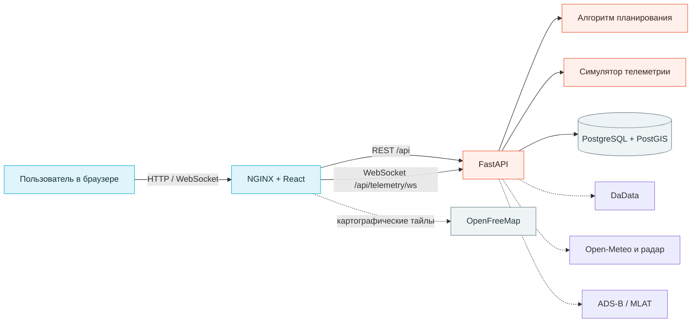
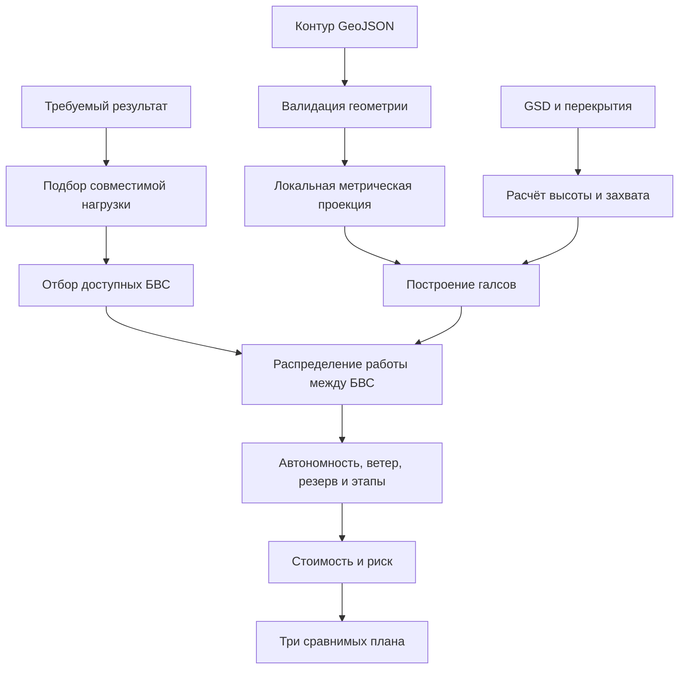

# Mission Control — техническое описание и локальное развёртывание

> **Примечание (25.09.2026).** Этот документ сохранён прежде всего как инструкция по развёртыванию и историческое описание конкурсного среза. Актуальное описание функций, алгоритма и ограничений находится в [технической документации сервиса](SERVICE_TECHNICAL_DOCUMENTATION.md); рабочие действия диспетчера — в [руководстве пользователя](DISPATCHER_USER_GUIDE.md). При расхождении продуктовых утверждений руководствуйтесь новыми документами и текущим кодом.

> [!summary] Коротко о продукте
> **Mission Control by CityMetrics** — прототип единого центра планирования и контроля работ беспилотных воздушных судов. Сервис связывает территорию, требуемый результат съёмки, характеристики оптики, доступность флота и стоимость выполнения в один понятный производственный план.

Документ рассчитан на две аудитории:

- членам жюри и бизнес-пользователям он объясняет, какую задачу решает система и почему выбранная архитектура подходит для эксплуатации;
- техническим специалистам он даёт структуру проекта, описание API, модель безопасности и воспроизводимую инструкцию запуска.

## 1. Назначение сервиса

Типичный процесс подготовки аэросъёмки состоит из нескольких разрозненных операций: оператор получает контур территории, подбирает БВС и полезную нагрузку, рассчитывает высоту и перекрытия, оценивает продолжительность, проверяет ресурс техники и договаривается о времени вылета. Ошибка на любом этапе может привести к повторному выезду, недостаточной детализации результата или конфликту ресурсов.

Mission Control объединяет коммерческий и производственный контур в одном интерфейсе:

1. Менеджер регистрирует заказчика и заявку; реквизиты можно заполнить по ИНН через DaData.
2. Заявка проходит квалификацию, коммерческое предложение и согласование с журналом статусов.
3. Согласованный заказ передаётся в планировщик вместе с территорией, датой и требованиями к результату.
4. Система проверяет совместимость БВС и нагрузки, занятость флота и погодное окно.
5. Алгоритм рассчитывает геометрию съёмки, этапы полёта, длительность, стоимость и резерв.
6. Диспетчер выбирает план; запись календаря и статус заказа изменяются одной операцией.
7. В Центре полётов отображаются задания, телеметрия, авиагоризонт, осадки и внешнее воздушное движение.
8. После полёта заказ проходит обработку, контроль качества и выдачу результата.

> [!info] Ценность для предприятия
> Сервис показывает не просто маршрут на карте, а объяснимое производственное решение: какой результат будет получен, каким оборудованием, за какое время, с каким резервом и стоимостью.

## 2. Функциональный контур прототипа

| Раздел | Что демонстрирует | Практическая ценность |
|---|---|---|
| Центр полётов | Карта, несколько активных БВС, задания, маршруты и телеметрия | Единая ситуационная картина для диспетчера |
| Заказы | Карточка заказчика и управляемая цепочка статусов | Прослеживаемость от запроса до выданного результата |
| Новое задание | Контур, тип результата, оптика, GSD, перекрытия, дата и время | Переход от требований заказчика к выполнимому плану |
| Инженерный расчёт | Высота AGL, полоса захвата, шаг галсов, интервал кадров | Прозрачность методики и проверяемость результата |
| Сравнение планов | Быстрый, экономичный и надёжный сценарии | Осознанный выбор между сроком, стоимостью и риском |
| Календарь | Месячное расписание и суточный план всех бортов | Предотвращение конфликтов и контроль загрузки |
| Погода | Прогноз, оценка риска и радар осадков | Осознанный выбор окна выполнения и раннее выявление угроз |
| Флот | Характеристики восьми демонстрационных БВС | Управление совместимостью и производительностью |
| Полезные нагрузки | Камеры, тепловизор, LiDAR и магнитометр | Подбор оборудования под требуемый результат |
| Технологические профили | Критерии приёмки и форматы выдачи | Связь полевого задания с ожидаемым продуктом |

## 3. Архитектура

Прототип построен как компактное трёхзвенное веб-приложение. Пользователю достаточно браузера; все серверные компоненты запускаются контейнерами.



### Почему архитектура разделена на три слоя

- **Веб-интерфейс** отвечает за карту, визуализацию и действия пользователя. Его можно обновлять без изменения расчётного ядра.
- **API и расчётное ядро** централизуют правила совместимости и методику расчёта. Это снижает риск расхождений между разными рабочими местами.
- **База данных** хранит расчёты, заказчиков, заказы, историю их статусов и календарные назначения.

NGINX является единой точкой входа: он отдаёт интерфейс и прозрачно направляет запросы `/api/*` в FastAPI. Благодаря этому браузер работает с одним адресом, а внутренняя структура системы не выставляется наружу.

## 4. Технологический стек

| Уровень | Технология | Роль в решении | Почему выбрана |
|---|---|---|---|
| Интерфейс | React 19 | Компонентный пользовательский интерфейс | Подходит для сложных интерактивных рабочих экранов |
| Язык интерфейса | TypeScript 5.7 | Типизация данных и контрактов | Снижает число ошибок при развитии интерфейса |
| Сборка | Vite 6 | Разработка и production-сборка | Быстрый цикл разработки и компактная конфигурация |
| Карта | MapLibre GL JS 5 | 2D/псевдо-3D карта, полигоны и маршруты | Открытый стек без привязки к коммерческому API |
| Иконки | Lucide React | Единая система интерфейсных обозначений | Читаемость и визуальная согласованность |
| API | FastAPI 0.115 | REST API, авторизация и WebSocket | Быстрая разработка типизированного Python API |
| Сервер | Uvicorn 0.34 | Запуск ASGI-приложения | Поддержка асинхронных запросов и WebSocket |
| Валидация | Pydantic 2.10 | Проверка входных данных API | Ошибочные параметры отклоняются до расчёта |
| Геометрия | Shapely 2.0 | Проверка и обработка полигонов | Надёжные геометрические операции |
| Проекции | pyproj 3.7 | Перевод WGS 84 в локальную метрическую систему | Расчёты расстояний и площадей выполняются в метрах |
| База данных | PostgreSQL 16 + PostGIS 3.4 | Хранение заданий и геопространственное развитие | Промышленная БД с поддержкой пространственных данных |
| Доступ к БД | asyncpg 0.30 | Асинхронная работа API с PostgreSQL | Не блокирует обслуживание других запросов |
| Внешние интеграции | httpx 0.28 | DaData, Open-Meteo, погодный радар и ADS-B | Единый асинхронный слой с кешем и деградацией |
| Обработка радара | Pillow 10.4 + NumPy 2.1 | Привязка и подготовка кадров осадков | Быстрое формирование прозрачного слоя для карты |
| Авторизация | PyJWT 2.10 + bcrypt 4.2 | Сессии и безопасное хранение паролей | Проверенные криптографические механизмы |
| Веб-сервер | NGINX 1.27 | Статика, SPA-маршрутизация, прокси API и WebSocket | Один стабильный вход в приложение |
| Контейнеризация | Docker Compose | Воспроизводимый запуск всего решения | Жюри не требуется вручную устанавливать Node.js, Python или PostgreSQL |

> [!note] Что не используется
> В текущем прототипе нет PyTorch, Cesium, Java, C++ или Rust. Эти технологии не добавлялись только ради формального совпадения со стеком отрасли. Расчёт остаётся детерминированным и объяснимым; ML целесообразно подключать после появления истории фактических полётов.

## 5. Как выполняется расчёт

Алгоритм последовательно проверяет исходные данные и только затем формирует варианты плана.



Для центральной проекции используются проверяемые зависимости:

```text
H = (GSD / 100) × f × Nx / Sx
W = H × Sx / f
Шаг галсов = W × (1 − поперечное перекрытие)
Шаг кадров = H × Sy / f × (1 − продольное перекрытие)
Интервал кадров = шаг кадров / путевая скорость
```

где:

- `H` — высота над поверхностью земли, м;
- `GSD` — размер пикселя на земле, см/пикс;
- `f` — физическое фокусное расстояние, мм;
- `Nx` — ширина изображения, пикс;
- `Sx`, `Sy` — размеры матрицы, мм;
- `W` — ширина полосы захвата, м.

Расчёт также проверяет максимальную частоту срабатывания камеры. Время полёта учитывает путь до участка, набор высоты, рабочие проходы, развороты, возврат, посадку и резерв автономности. Стоимость раскладывается на моточасы, энергию или топливо, экипаж, батареи, обслуживание, обработку и риск.

### 5.1. Как выбирается направление галсов

Контур WGS 84 переводится в локальную UTM, поэтому геометрический расчёт выполняется в метрах. Ядро сравнивает длинную ось минимального ориентированного прямоугольника, перпендикуляр к ней и базовые направления 0°, 45°, 90°, 135°. Для каждого направления строится полный набор параллельных линий, обрезанных разрешённой частью полигона, и маршрут «змейкой» от ближайшего конца очередного галса.

Оценка учитывает одновременно полезный путь, холостые переходы и ветер:

```text
J(θ) = Lsurvey × Va/2 × (1/Vg+ + 1/Vg−)
     + 2,2 × Lconnectors
     + 0,35 × Lsurvey × (|W⊥|/Va)²
```

Здесь `Vg+` и `Vg−` — путевые скорости на прямом и обратном проходах. Направление ветра задаётся по метеорологическому правилу «откуда дует». Для каждого курса вектор ветра раскладывается на продольную и боковую составляющие:

```text
W∥ = W × cos(ψw→ − ψg)
W⊥ = W × sin(ψw→ − ψg)
Vg = √(Va² − W⊥²) + W∥
```

Модель предполагает компенсацию сноса углом упреждения. Невыполнимые направления отбрасываются. Для расчёта автономности дополнительно применяется худший встречный ветер `Va − W`, а камера проверяется по худшей попутной скорости `Va + W`. Поэтому алгоритм не занижает продолжительность и одновременно не допускает потери продольного перекрытия. API возвращает блок `wind_analysis` с выбранным азимутом, обеими путевыми скоростями, боковой составляющей и политиками запаса.

Выбор детерминирован и объясним: это не ML-модель и не «чёрный ящик». Коэффициенты целевой функции открыты и могут быть откалиброваны по журналам реальных полётов без изменения правил безопасности. Полное описание, включая секторизацию, автономность и PlantUML-схему, приведено в [методике планирования](planning-methodology.md).

### 5.2. Жёсткие ограничения и критерии оптимизации

| Тип | Что учитывается |
|---|---|
| Жёсткое ограничение | совместимость БВС и нагрузки, потолок, частота кадров, предельный ветер, автономность с резервом, целостность галса, безопасные буферы |
| Геометрическая оптимизация | длина рабочих линий, переходы между ними, направление ветра и боковая составляющая |
| Ресурсная оптимизация | непрерывные сектора, число БВС, число вылетов, обслуживание между вылетами |
| Бизнес-критерий | время завершения, полная расчётная стоимость, повышенный резерв |
| Явно не заявляется | разрешение на полёт, готовая траектория автопилота, доказанная 4D-деконфликтация, вероятность отказа без статистики |

Перед построением вариантов ядро сопоставляет территорию и дату задания со справочником запретных и опасных зон, пользовательскими препятствиями и зонами ответственности ОрВД. Для транзитных участков строится обход безопасного буфера; препятствия внутри территории исключаются из рабочих галсов. Если сама территория заказчика попадает в запретную или опасную зону, сервис не скрывает это изменением контура, а возвращает статус «требуется разрешение». Близкие трассы нескольких БВС получают разнесённые слоты старта и обязательную отметку о последующей 4D-проверке.

> [!warning] Инженерная граница прототипа
> Полученный маршрут является предварительным производственным планом, а не командой для автопилота. Сервис выполняет первичную проверку загруженных ограничений и объясняет результат, но перед реальным вылетом всё равно необходимы подтверждение актуальных режимов/NOTAM, контакт с ОрВД, необходимые разрешения, проверка рельефа, погоды и руководства по эксплуатации конкретного БВС.

## 6. Структура проекта

```text
mission-control/
├── src/
│   ├── App.tsx                 # основные экраны и клиентская логика
│   ├── OrdersWorkspace.tsx     # реестр заказов и карточка заказчика
│   ├── CalendarDashboard.tsx   # календарь и суточный план
│   ├── AirspaceWorkspace.tsx   # реестр ограничений и зон ОрВД
│   ├── AttitudeIndicator.tsx   # авиагоризонт выбранного борта
│   ├── PolygonEditor.tsx       # редактирование территории на карте
│   ├── scheduleData.ts         # согласованный демонстрационный журнал
│   ├── catalogContent.ts       # пояснения к справочникам
│   ├── styles.css              # базовые стили интерфейса
│   └── revision.css            # актуальные доработки интерфейса
├── public/fleet/               # локальные изображения БВС и нагрузок
├── backend/
│   ├── app/
│   │   ├── main.py             # HTTP API, WebSocket и авторизация
│   │   ├── models.py           # входные модели и валидация
│   │   ├── airspace.py         # нормализация геозон и пространственные фильтры
│   │   ├── airspace_planning.py# оценка конфликтов и безопасные обходы
│   │   ├── mission_export.py   # KML, GeoJSON и GPX
│   │   ├── data/airspace/      # неизменяемые нормативные GeoJSON-наборы
│   │   ├── catalog.py          # БВС, нагрузки, профили и пользователи
│   │   ├── optimizer.py        # расчётное ядро
│   │   ├── simulation.py       # воспроизводимая телеметрия
│   │   ├── orders.py           # бизнес-процесс и демонстрационные заказы
│   │   ├── dadata.py           # нормализованный адаптер DaData
│   │   ├── weather.py          # прогноз, риск и радар осадков
│   │   └── traffic.py          # внешний ADS-B/MLAT трафик
│   ├── tests/                  # автоматические проверки расчёта
│   ├── requirements.txt
│   └── Dockerfile
├── infra/postgres/init/        # включение расширения PostGIS
├── deploy/                     # инструкция и пример для Caddy
├── Dockerfile                  # production-сборка React + NGINX
├── nginx.conf                  # маршрутизация SPA, API и WebSocket
├── docker-compose.jury.yml     # автономный конкурсный запуск
├── docker-compose.yml          # серверный запуск за reverse proxy
└── .env.example                # шаблон production-настроек
```

## 7. API

Все методы, кроме входа и проверки состояния, требуют действующую сессию. Интерактивная схема OpenAPI доступна после запуска по адресу [http://localhost:8080/docs](http://localhost:8080/docs).

### Сводная таблица

| Метод | Адрес | Назначение | Доступ |
|---|---|---|---|
| `GET` | `/api/health` | Состояние API, БД и интеграций | Без авторизации |
| `POST` | `/api/auth/login` | Вход и создание сессии | Без авторизации |
| `POST` | `/api/auth/logout` | Завершение сессии | Пользователь |
| `GET` | `/api/auth/me` | Данные текущего пользователя | Пользователь |
| `GET` | `/api/catalog/uavs` | Справочник БВС | Пользователь |
| `GET` | `/api/catalog/optics` | Справочник оптики | Пользователь |
| `GET` | `/api/catalog/payloads` | Справочник полезных нагрузок | Пользователь |
| `GET` | `/api/catalog/technologies` | Технологические профили | Пользователь |
| `GET` | `/api/catalog/bases` | Площадки базирования | Пользователь |
| `GET`, `POST` | `/api/orders` | Реестр и регистрация заказов | Пользователь / диспетчер, руководитель, администратор |
| `PATCH` | `/api/orders/{id}/status` | Допустимый переход заказа | По роли и этапу процесса |
| `GET`, `POST` | `/api/schedule` | Расписание и назначение БВС | Пользователь / диспетчер, администратор |
| `POST` | `/api/schedule/batch` | Атомарное назначение всех БВС выбранного плана с общим `missionGroupId` и проверкой пересечения слотов | Диспетчер, администратор |
| `GET` | `/api/integrations/dadata/suggest` | Поиск организации по названию или ИНН | Пользователь |
| `GET` | `/api/weather/forecast` | Прогноз и оценка риска | Пользователь |
| `GET` | `/api/weather/radar` | Доступные кадры радара осадков | Пользователь |
| `GET` | `/api/weather/radar/frame/{index}.png` | Привязанный кадр осадков | Пользователь |
| `GET` | `/api/traffic/aircraft` | Нормализованный ADS-B/MLAT трафик | Пользователь |
| `GET` | `/api/airspace/summary` | Количество зон по типам и перечень источников | Пользователь |
| `GET` | `/api/airspace/zones` | GeoJSON-реестр с фильтрами `category`, `bbox` и `q` | Пользователь |
| `POST` | `/api/airspace/zones/import` | Импорт GeoJSON FeatureCollection | Диспетчер, администратор |
| `POST`, `PUT`, `DELETE` | `/api/airspace/zones` | Ведение пользовательских зон и препятствий | Диспетчер, администратор |
| `GET`, `PUT` | `/api/airspace/authorities` | Контакты ОрВД и режим взаимодействия | Пользователь / диспетчер, администратор |
| `POST` | `/api/missions/optimize` | Расчёт трёх вариантов миссии | Диспетчер, администратор |
| `GET` | `/api/missions` | История сохранённых расчётов | Пользователь |
| `GET` | `/api/missions/{id}/export` | Экспорт выбранного варианта в KML, GeoJSON или GPX | Пользователь |
| `WS` | `/api/telemetry/ws` | Поток телеметрии нескольких БВС | Пользователь |

### Авторизация

Запрос:

```http
POST /api/auth/login
Content-Type: application/json

{
  "username": "dispatcher",
  "password": "dispatcher"
}
```

При успешном входе сервер устанавливает HttpOnly-cookie `mc_session`. JavaScript интерфейса не может прочитать токен напрямую, но браузер автоматически передаёт его API и WebSocket.

### Расчёт миссии

Упрощённый пример запроса:

```json
{
  "name": "Ортофотоплан — конкурсный участок",
  "area": {
    "type": "Polygon",
    "coordinates": [[[37.457,55.787],[37.480,55.787],[37.480,55.777],[37.457,55.777],[37.457,55.787]]]
  },
  "result_type": "orthophoto",
  "result_types": ["orthophoto"],
  "survey_type": "rgb",
  "payload_id": "payload-sony-61",
  "gsd_cm_px": 5,
  "max_flight_altitude_m": 150,
  "side_overlap": 0.60,
  "forward_overlap": 0.70,
  "wind_speed_mps": 3.2,
  "wind_direction_deg": 315,
  "precipitation_probability": 0.05,
  "visibility_m": 18000
}
```

API проверяет:

- тип и корректность полигона;
- допустимые диапазоны числовых параметров;
- совместимость типа съёмки, нагрузки и БВС;
- возможность выполнить работу с учётом автономности и резерва.

Ответ содержит три плана — `fast`, `economy`, `safe`. Для каждого возвращаются:

- продолжительность и стоимость;
- количество задействованных БВС;
- риск и пояснения;
- маршруты перелёта и покрытия в GeoJSON;
- количество вылетов и резерв;
- этапы полёта;
- инженерные параметры оптики;
- детализация стоимости.

Если PostgreSQL доступен, запрос и результат сохраняются под уникальным идентификатором миссии.

### Телеметрия WebSocket

После авторизации клиент подключается к:

```text
ws://localhost:8080/api/telemetry/ws
```

Сервер раз в секунду передаёт согласованный снимок состояния активных БВС: координаты, высоту, скорость, курс, тангаж, крен, вертикальную скорость, заряд, качество канала, спутники и процент выполнения задания. Для конкурса используется контролируемый симулятор — демонстрация не зависит от доступности внешнего ADS-B.

## 8. Данные и согласованность

В прототипе используются три вида данных:

| Данные | Источник | Хранение |
|---|---|---|
| Справочники БВС, сенсоров и технологий | Демонстрационная модель предприятия | Python-модуль `catalog.py` |
| Расчёты миссий | Ввод пользователя и расчётное ядро | PostgreSQL, таблица `missions` |
| Календарный журнал | Согласованный конкурсный набор + новые записи | API и PostgreSQL (в локальном режиме — серверное хранилище в памяти) |

Календарь содержит завершённые, активные, запланированные задания и обслуживание. Отдельно предусмотрены дни полной загрузки совместимых БВС, чтобы показать запрет конфликтного планирования.

> [!important] Ограничение конкурсной версии
> При развёртывании с PostgreSQL назначения и проверки конфликтов выполняются сервером; группа БВС создаётся транзакционно. В локальном режиме без PostgreSQL используется серверная память: записи не переживают перезапуск API. Перед промышленной эксплуатацией необходимы блокировка конкурирующих транзакций на уровне всех сценариев редактирования и полная интеграция с эксплуатационным контуром.

## 9. Безопасность

### Реализованные меры

- Пароли не хранятся в открытом виде во время работы API: при запуске формируются bcrypt-хеши.
- Сессия подписывается алгоритмом HS256 и имеет срок действия 10 часов.
- Токен передаётся в HttpOnly-cookie, недоступной клиентскому JavaScript.
- Production-режим поддерживает флаг cookie `Secure`.
- Cookie использует `SameSite=Lax`.
- Для расчёта миссий действует ролевая проверка: диспетчер или администратор.
- Pydantic проверяет типы, диапазоны и обязательные поля входных запросов.
- Геометрия дополнительно проверяется расчётным ядром, включая самопересечения.
- CORS ограничивается списком разрешённых адресов.
- NGINX добавляет `X-Content-Type-Options`, `Referrer-Policy` и `Permissions-Policy`.
- В production Compose API и PostgreSQL не публикуют порты в сеть хоста.
- Секреты передаются через `.env`, который исключён из Git и Docker-контекста.

### Что потребуется перед промышленной эксплуатацией

- подключить корпоративный провайдер идентификации или отдельное хранилище пользователей;
- добавить ротацию ключей, восстановление доступа и политику сложности паролей;
- внедрить CSRF-защиту для изменяющих запросов;
- добавить ограничение частоты входа и защиту от перебора паролей;
- вести неизменяемый журнал действий операторов;
- довести все операции изменения календаря и справочников до единой транзакционной серверной модели;
- выполнять резервное копирование и проверку восстановления;
- настроить мониторинг, централизованные журналы и оповещения;
- провести анализ угроз и независимый аудит перед подключением реальных БВС.

> [!danger] Конкурсные учётные записи
> Логины и пароли `dispatcher / dispatcher`, `manager / manager`, `admin / admin` предназначены только для локальной демонстрации. Их нельзя использовать при публикации сервиса в интернет.

# 10. Подробная инструкция для конкурсного жюри

## 10.1. Системные требования

- Windows 10/11, macOS или современный Linux;
- Docker Desktop либо Docker Engine с плагином Docker Compose;
- минимум 4 ГБ свободной оперативной памяти;
- минимум 5 ГБ свободного места;
- свободный локальный TCP-порт `8080`;
- подключение к интернету для первой загрузки Docker-образов и картографической подложки.

Устанавливать Node.js, Python, PostgreSQL или NGINX отдельно не требуется.

## 10.2. Получение проекта

Распакуйте архив проекта либо клонируйте репозиторий. Затем откройте терминал в каталоге `mission-control`, где находится файл `docker-compose.jury.yml`.

Проверьте доступность Docker:

```bash
docker --version
docker compose version
```

Docker Desktop должен быть запущен до выполнения следующих команд.

## 10.3. Запуск одной командой

### Windows PowerShell, Linux и macOS

```bash
docker compose -f docker-compose.jury.yml up -d --build
```

При первом запуске Docker скачает базовые образы, соберёт интерфейс и API, создаст базу данных и дождётся готовности каждого компонента. В зависимости от скорости интернета это может занять несколько минут.

Проверьте состояние:

```bash
docker compose -f docker-compose.jury.yml ps
```

У сервисов `db`, `api` и `mission-control` должен появиться статус `healthy`.

## 10.4. Открытие сервиса

Перейдите в браузере по адресу:

**[http://localhost:8080](http://localhost:8080)**

Рекомендуемая учётная запись:

| Поле | Значение |
|---|---|
| Логин | `dispatcher` |
| Пароль | `dispatcher` |

Остальные конкурсные пользователи:

| Роль | Логин | Пароль |
|---|---|---|
| Руководитель | `manager` | `manager` |
| Администратор | `admin` | `admin` |

Для полного сценария создания и расчёта задания используйте роль диспетчера или администратора.

## 10.5. Проверка работоспособности

Откройте следующие адреса:

- [http://localhost:8080/healthz](http://localhost:8080/healthz) — должен отображаться текст `ok`;
- [http://localhost:8080/api/health](http://localhost:8080/api/health) — JSON должен содержать `"status":"ok"` и `"database":true`;
- [http://localhost:8080/docs](http://localhost:8080/docs) — интерактивное описание API.

Проверка из терминала Linux или macOS:

```bash
curl -fsS http://localhost:8080/healthz
curl -fsS http://localhost:8080/api/health
```

Проверка в Windows PowerShell:

```powershell
Invoke-RestMethod http://localhost:8080/healthz
Invoke-RestMethod http://localhost:8080/api/health
```

## 10.6. Рекомендуемый демонстрационный сценарий

1. Войти как `dispatcher`.
2. Открыть **Центр полётов** и переключить несколько БВС в правой панели — карта плавно переместится к выбранному борту.
3. Проверить телеметрию: скорость, высоту, ориентацию, вертикальную скорость, батарею и связь.
4. Открыть **Новое задание**.
5. Изменить контур вручную либо импортировать собственный GeoJSON Polygon.
6. Выбрать результат и подходящую полезную нагрузку.
7. Изменить GSD и убедиться, что высота, захват и шаг галсов пересчитываются.
8. Нажать **Рассчитать производственный план**.
9. Сравнить быстрый, экономичный и надёжный варианты, этапы полёта и стоимость.
10. Выбрать будущую дату и свободный БВС, затем добавить задание в календарь.
11. Для демонстрации дефицита выбрать 18 сентября 2026 года, 09:00 и RGB-камеру Sony ILX-LR1 — совместимые носители заняты.
12. Открыть **Календарь** и нажать на ячейку дня: появится суточный план всех восьми бортов.
13. Открыть справочники флота, нагрузок и технологических профилей.

## 10.7. Просмотр журналов

Все сервисы:

```bash
docker compose -f docker-compose.jury.yml logs -f
```

Только API:

```bash
docker compose -f docker-compose.jury.yml logs -f api
```

Выйти из режима просмотра можно сочетанием `Ctrl+C`; сами контейнеры продолжат работу.

## 10.8. Остановка и повторный запуск

Остановить сервис:

```bash
docker compose -f docker-compose.jury.yml down
```

Повторно запустить без пересборки:

```bash
docker compose -f docker-compose.jury.yml up -d
```

Данные PostgreSQL сохраняются в Docker-томе `mission_jury_db` после обычной остановки.

## 10.9. Полный сброс демонстрации

> [!warning] Команда удалит локальную базу Mission Control
> Используйте её только тогда, когда требуется вернуть конкурсный стенд в исходное состояние.

```bash
docker compose -f docker-compose.jury.yml down -v
docker compose -f docker-compose.jury.yml up -d --build
```

Календарные записи, добавленные через интерфейс, находятся в `localStorage` браузера. Для их сброса очистите данные сайта `localhost:8080` в настройках браузера.

## 10.10. Если порт 8080 занят

Linux или macOS:

```bash
APP_PORT=8090 docker compose -f docker-compose.jury.yml up -d --build
```

Windows PowerShell:

```powershell
$env:APP_PORT="8090"
docker compose -f docker-compose.jury.yml up -d --build
```

После этого откройте `http://localhost:8090`.

## 10.11. Типовые проблемы

### Страница не открывается

1. Убедитесь, что Docker Desktop запущен.
2. Выполните `docker compose -f docker-compose.jury.yml ps`.
3. Посмотрите `docker compose -f docker-compose.jury.yml logs --tail=100`.
4. Проверьте, не занят ли порт 8080 другим приложением.

### Отображается `Failed to fetch` при входе

1. Проверьте [http://localhost:8080/api/health](http://localhost:8080/api/health).
2. Убедитесь, что контейнер `api` имеет статус `healthy`.
3. Выполните `docker compose -f docker-compose.jury.yml logs --tail=100 api`.
4. При первом запуске дождитесь готовности PostgreSQL и обновите страницу.

### Карта не загружается, но меню работает

Картографическая подложка поступает из OpenFreeMap и требует доступа в интернет. Расчётное ядро, справочники и симулятор телеметрии работают внутри стенда, однако без тайлов фон карты будет недоступен.

### После изменения исходников видна старая версия

Пересоберите контейнер:

```bash
docker compose -f docker-compose.jury.yml up -d --build --force-recreate mission-control
```

Затем выполните полное обновление страницы в браузере.

## 10.12. Удаление стенда после оценки

Удалить контейнеры, сеть и конкурсную базу:

```bash
docker compose -f docker-compose.jury.yml down -v --remove-orphans
```

Загруженные базовые Docker-образы останутся в системе и могут быть удалены стандартными средствами Docker Desktop.

## 11. Production-развёртывание

Для публикации на `mission.citymetrics.moscow` предусмотрены основной `docker-compose.yml`, `.env.example` и `deploy/Caddyfile.mission-control`. В production-режиме:

- генерируются уникальные пароли и JWT-секрет;
- включается `COOKIE_SECURE=true`;
- разрешённым источником становится `https://mission.citymetrics.moscow`;
- наружу не публикуются порты приложения, API и БД;
- Caddy завершает TLS и передаёт запросы контейнеру Mission Control;
- PostgreSQL и API остаются во внутренней сети.

Подробные серверные команды приведены в [[../deploy/README|инструкции по production-развёртыванию]]. Для конкурсной локальной проверки Caddy, домен и production-файл `.env` не нужны.

### Необязательные интеграции при локальном запуске

Без ключа `DADATA_API_KEY` форма заказа остаётся работоспособной в ручном режиме. Карта, Open-Meteo, радар и публичный ADS-B требуют доступа в интернет, но их отказ не блокирует заказы, расчёт и календарь. Для production ключи и интервалы кеширования задаются в `.env`; секреты не попадают в браузер.

## 12. Автоматические проверки

В проекте предусмотрены 29 серверных тестов. Они проверяют:

- формирование трёх объяснимых планов;
- воспроизводимость геометрии камеры;
- влияние GSD и перекрытий;
- ограничение высоты;
- совместимость полезных нагрузок;
- отбраковку неправильных и самопересекающихся полигонов;
- резерв автономности;
- согласованность этапов и стоимости;
- корректность маршрута от полевой точки старта;
- физически согласованное движение симулятора телеметрии;
- допустимые переходы заказа и запрет прошедших дат;
- линейные задания для теплотрасс и ЛЭП;
- нормализацию ответа DaData и погодную оценку риска;
- резервирование и кеширование источников ADS-B.

Запуск тестов из подготовленного Python-окружения разработчика:

```bash
cd backend
python -m unittest discover -s tests -v
```

Production-сборка интерфейса выполняет проверку TypeScript перед созданием статических файлов:

```bash
pnpm build
```

## 13. Итог

Mission Control демонстрирует технически связный путь от требований к результату до производственного плана и контроля исполнения. Сильная сторона решения — прозрачная инженерная методика, совместное планирование ресурсов и наглядная работа нескольких БВС. Контейнерная поставка делает демонстрацию воспроизводимой: конкурсному жюри требуется только Docker и браузер.

При переходе от прототипа к эксплуатации основными направлениями развития станут нормативная геозональная проверка, полный аудит действий, интеграция с ЭДО и наземными станциями управления, а также обучение прогнозных моделей на накопленной фактической истории.
